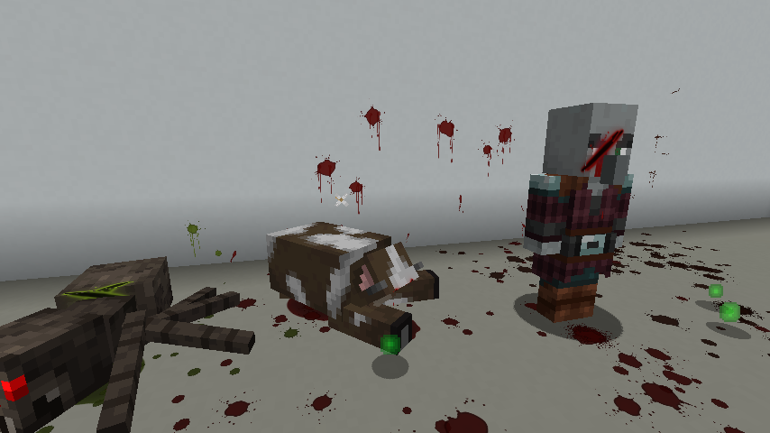
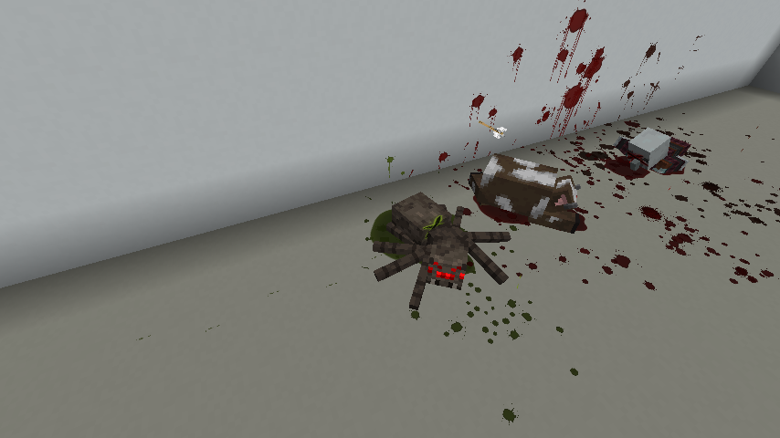

# Visceral — Wounds, Blood & Ragdolls

A Fabric mod for **Minecraft 1.21.11** that makes every hit leave a mark.

* **Blades cut.** Swords, hoes and shears open bleeding slashes; axes leave deep gashes; arrows,
  tridents, spears and pickaxes punch holes; wolves and spiders bite; bears and cats claw.
* **Fists bruise.** Bare-handed punches (and maces, shovels, falls, explosions) leave bruises that
  change colour as they heal: red → purple → blue → green/yellow, then fade.
* **Wounds sit exactly where the blow landed.** The server records the swing as a ray; the client
  casts it against the creature's actual model and wraps the decal around the cube it hit, so it
  follows every animation — and stays on the corpse.
* **Realistic blood.** Motion-blurred droplets spray in the direction of the blow, mist puffs, back
  spatter towards the attacker, big directional splashes on the wall behind the victim, runs that
  drip down walls, drops that fan out on the floor when a creature falls hard, clouds of blood under
  water, sizzling in lava.
* **Bleeding.** Open wounds drip while they bleed (a status effect with damage over time, shown in
  your HUD), fresh deep cuts spurt with the heartbeat, moving creatures leave drip trails and still
  ones form puddles under them. Getting cut yourself splatters the edges of your screen.
* **Stains and pools.** Every drop that lands leaves a stain clipped to the real block shapes (slabs,
  stairs, carpets, walls, ceilings). Fresh blood is bright and wet, then dries dark over minutes;
  rain slowly washes exposed blood away, water erases it, and it vanishes with the block it was on.
  Corpses bleed out into a growing pool.
* **Ragdoll physics.** On death, creatures collapse into a physics ragdoll instead of tipping over:
  a substepped XPBD rigid-body simulation with ball joints and cone limits, self-collision, friction
  against real block collision boxes, the killing blow's momentum, explosions that launch corpses,
  and corpses you can kick around by walking into them. Armour, held items, wool, saddles and every
  other layer follow the simulated bones. Corpses linger, then sink into the ground.
* **Every creature bleeds its own way.** Red for animals and people, dark congealed blood for the
  undead, green hemolymph for spiders and creepers, purple for endermen, blue for squid and
  nautiluses, goo for slimes, glowing magma for magma cubes. Skeletons chip bone, iron golems throw
  sparks, snow golems puff snow, blazes shed embers, the creaking splinters.

Works with modded mobs: wounds and ragdolls are built from whatever model the renderer uses.

| Sword wounds, blood running down the face, wall spatter | Ragdolled corpses bleeding out into pools |
| --- | --- |
|  |  |

<sub>Screenshots from the automated in-game test (software rendering, default resources).</sub>

## Requirements

* Minecraft 1.21.11, Fabric Loader ≥ 0.17, Fabric API.
* Install on the **client and the server** (singleplayer: just the client). The server decides wounds
  and bleeding; all the visuals are client side.

## Configuration

`config/visceral.json` is created on first launch. Highlights:

| Option | Default | |
| --- | --- | --- |
| `bleedingDamage` / `bleedDamagePerPulse` | `true` / `1.0` | Damage over time from open wounds |
| `bleedDurationMultiplier` | `1.0` | How long wounds bleed |
| `bleedingCanKill` | `true` | `false` stops bleeding damage at half a heart |
| `playersBleed` | `true` | Bleeding damage for players |
| `woundHealSeconds` | `600` | When wounds disappear from living creatures |
| `bloodTypeOverrides` | `{}` | e.g. `{"minecraft:pig": "green"}`; types: red, dark, green, slime, magma, purple, blue, cyan, sculk, black, bone, metal, copper, wood, snow, ember, spirit, none |
| `bloodAmount` | `1.0` | Particle multiplier (also follows the vanilla particle setting) |
| `maxStains` / `stainLifetimeSeconds` | `2500` / `900` | Blood decals in the world |
| `ragdolls`, `ragdollPlayers` | `true` | Toggle ragdolls |
| `ragdollLifetimeSeconds`, `maxRagdolls` | `45`, `32` | Corpse limits |
| `ragdollGravity`, `ragdollImpulseScale` | `22`, `1.0` | Physics feel |
| `screenBlood`, `rainWashesBlood`, `ragdollEntityPushing` | `true` | Extras |

Client commands: `/visceral clear` (remove all blood and corpses), `/visceral reload` (reload the
config), `/visceral stats`.

## Building

```sh
./gradlew build            # jar in build/libs/
python3 tools/generate_textures.py   # regenerate the procedural textures (numpy + Pillow)
```

Gradle 9.2 and Loom 1.14 run on Java 21.

### Automated in-game test

`./gradlew runClientGameTest` starts the real client, builds an arena, cuts, punches and kills a
line of creatures and saves screenshots of every stage to `build/run/clientGameTest/screenshots`.
On a headless machine: `xvfb-run -a ./gradlew runClientGameTest` (software OpenGL works).

## How it works

* **Server** (`dev.visceral.wound`): a mixin on `LivingEntity.hurtServer` classifies each hit from
  its damage source and weapon, stores the wound (type, severity, the blow as a ray in the body's
  frame) in a synced, persistent Fabric data attachment, applies the bleeding effect and sends a
  small hit packet.
* **Wound decals** (`client.wound`): a render layer on every living entity resolves the ray against
  the posed `ModelPart` cubes, then clips a decal to the hit face and unfolds it over neighbouring
  faces. Geometry is stored in part space, so it animates with the part.
* **Blood** (`client.fx`): a dedicated particle simulation and a decal system clipped to block
  collision boxes, drawn through the 1.21.11 submit-node pipeline.
* **Ragdolls** (`client.ragdoll`): the death pose is captured from the exact model vanilla is about
  to draw. Parts become oriented-box rigid bodies (overlays and glued parts ride along), jointed by
  hierarchy or, for flat biped/quadruped layouts, by proximity to the heaviest part. Each frame the
  simulated transforms are written back into every model sharing the part names right after
  vanilla's `setupAnim`, so armour and layers follow; corpses keep rendering after the entity is
  removed.

## License

MIT
