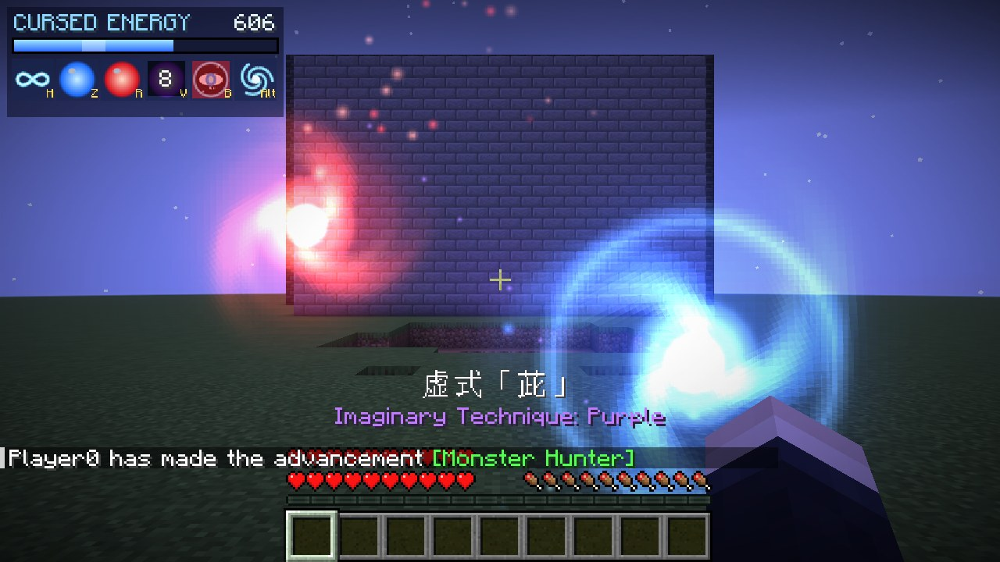
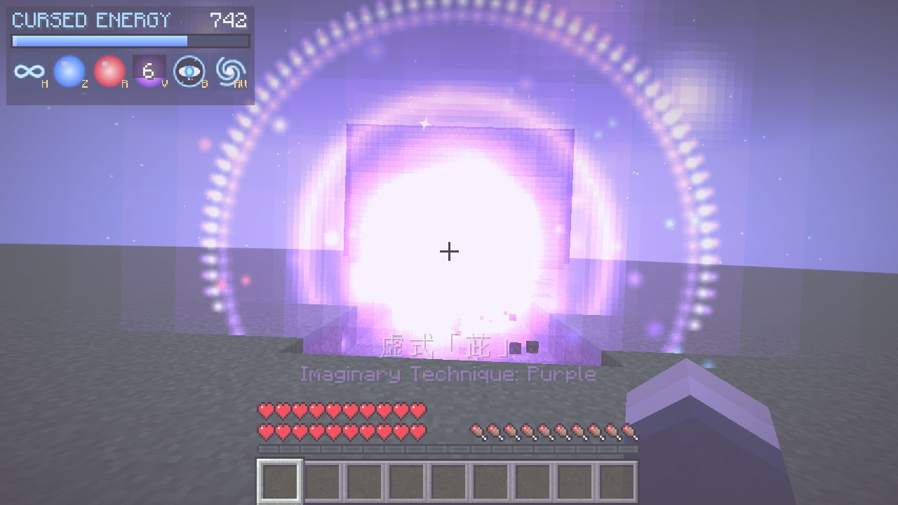
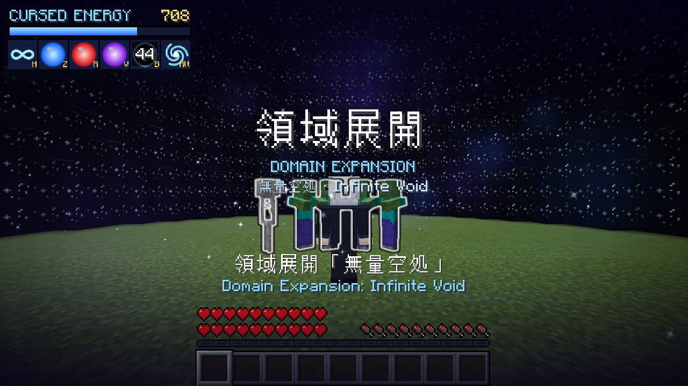

# Gojo Satoru (Fabric 1.21.11)

Turn into Gojo Satoru and use Limitless: Infinity, Blue, Red, Hollow Purple and
Domain Expansion: Infinite Void.





More in [`screenshots/`](screenshots): Blue, Red, Infinity stopping an arrow, the domain from
outside, and the skin. They were taken by the automated in-game test.

## Install

1. Install Fabric Loader for Minecraft **1.21.11**.
2. Put `download/gojo-satoru-1.0.0.jar` and **Fabric API** into `.minecraft/mods`.
3. Launch the Fabric 1.21.11 profile.

## Controls

All keys can be changed in **Options > Controls > Key Binds > Gojo Satoru**.

| Key | Technique |
| --- | --- |
| `G` | Transform into Gojo / turn back |
| `H` | Infinity on/off |
| `Z` (hold) | Cursed Technique Lapse: **Blue**. Hold to drag the orb with your aim, release to crush |
| `R` | Cursed Technique Reversal: **Red** |
| `V` | Imaginary Technique: **Hollow Purple** |
| `B` | Domain Expansion: **Infinite Void** (press again to close it early) |
| `Left Alt` | Teleport to where you are looking |

## What you get

- **Gojo form**: Gojo's skin (blindfold, white hair, Jujutsu High uniform), 40 max health,
  faster movement, higher jumps, stronger punches, flight (double-tap jump), night vision,
  and Reverse Cursed Technique healing.
- **Six Eyes**: hostile mobs within 30 blocks are outlined through walls. The blindfold comes
  off for Hollow Purple and Infinite Void, and the eyes glow in the dark.
- **Infinity**: incoming damage stops before it reaches you. Arrows and fireballs freeze in
  mid-air, and monsters are held back. Each blocked hit costs a little cursed energy.
- **Blue**: a point of attraction that follows your aim. It pulls in mobs, items and chunks
  of terrain, then implodes when you let go.
- **Red**: charges at your fingertip, then flies out and detonates into a repulsion blast
  that hurls everything away.
- **Hollow Purple**: Blue and Red spiral together and collide, and the purple mass erases
  everything in its path for about 115 blocks, leaving a tunnel.
- **Infinite Void**: a starry dome closes around you. Everything else inside is frozen and
  overwhelmed, and your cursed energy refills three times faster.
- **HUD**: cursed energy bar, cooldowns and technique names (in Japanese and English).

Creative mode skips the cursed energy cost.

## Protecting your builds

Blue, Red and Hollow Purple destroy blocks by default. To keep the terrain intact:

```
/gamerule gojo:block_destruction false
```

## Building from source

```
./gradlew build                  # jar ends up in build/libs/
python3 tools/gen_textures.py    # regenerate the skin, glows and icons
xvfb-run ./gradlew runClientGameTest   # automated in-game test with screenshots
```
