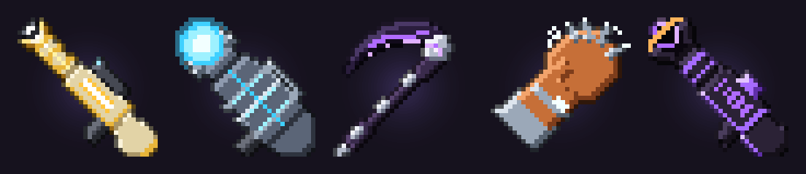
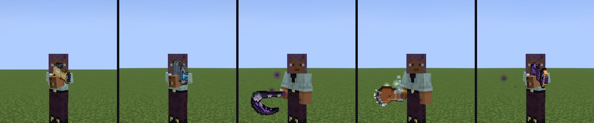
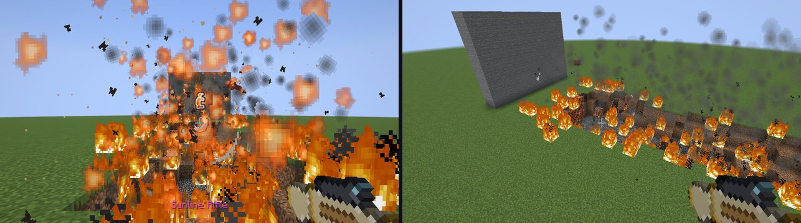
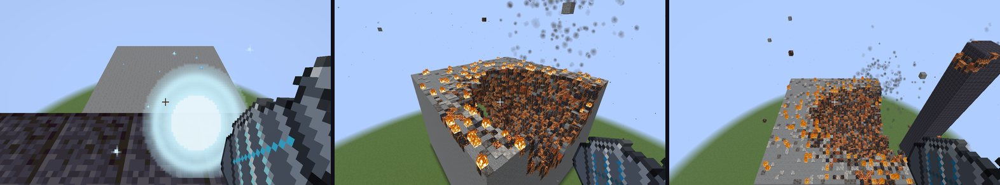
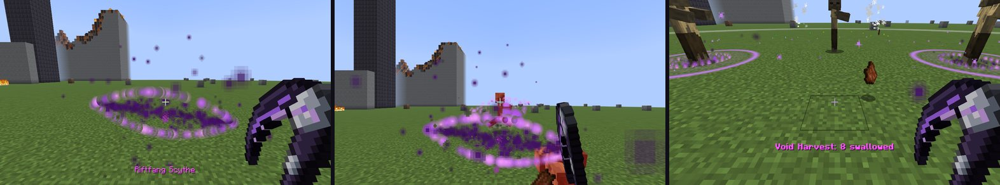
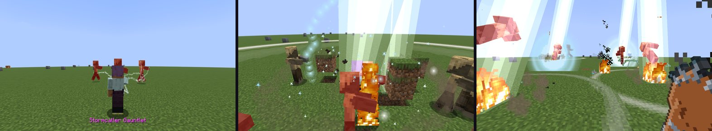
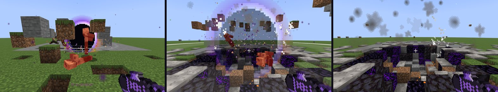

# Overkill Arsenal

A Fabric mod for **Minecraft 1.21.11** that adds five absurdly overpowered weapons, plus the particles, screen shake and burning aftermath they leave behind.





*All in-game screenshots come from the automated headless showcase test (see [Headless showcase test](#headless-showcase-test)).*

| Weapon | What it does |
|---|---|
| **Sunline Rifle** | An instant 160-block beam. 0.6 s later, the whole line detonates in a chain of fiery explosions. |
| **Worldbreaker Orb Cannon** | Charge it, then fire a slow orb that drills through mountains and leaves a crater up to 30 wide and 40 deep. |
| **Riftfang Scythe** | Every hit tears space. Enemies fall through the tears and drop out of the sky. |
| **Stormcaller Gauntlet** | Punches build up lightning charge for chain lightning, Thunder Call and a leaping Thunderfall Slam. |
| **Gravemaker** | Fires black holes that pull in mobs, items and ripped-up terrain, then implode and explode outward. |

All five are in the **Overkill Arsenal** creative tab and can be crafted in survival (see [Recipes](#recipes)).

---

## The weapons

### Sunline Rifle


- **Right-click** traces an instant white-gold beam up to **160 blocks**. It passes through mobs and stops at the first solid block.
- Everything on the line takes 6 damage, is set on fire and gets **Sunmarked**, which makes it glow.
- **0.6 seconds later** the line erupts. Explosions race from the muzzle to the impact point, leaving fire, scorched stone, molten rock, sand fused into glass, and smoldering ash.
- Sunmarked targets take an extra **22 damage** when the blast reaches them, burn for 8 s and get **Searing II**.
- The impact point gets a splash of molten rock and flying debris. Cooldown: 5 s.

### Worldbreaker Orb Cannon


- **Hold right-click to charge.** The orb grows at the muzzle and the hum rises. There are three stages, at **1 s, 3 s and 6 s**.
- **Release** to fire a slow, heavy orb that ignores gravity and collision. It erases a tunnel through everything in its path and lines it with molten rock.
- Once it has burrowed deep enough (40 blocks at full charge), it detonates. It carves a funnel crater from where it entered the ground down to the blast point: **about 30 wide and 40 deep at full charge**.
- The crater's walls are lined with molten rock, magma and scorched stone, and the rim is left burning and covered in ash. Debris rains down around it, and nearby water, lava and sand pour into the hole.
- **Overcharge warning:** holding a full charge for more than 2.5 s makes the cannon unstable (an alarm sounds and the screen shakes). Keep holding and it **backfires** on you.

| Stage | Hold | Tunnel radius | Burrow depth | Crater |
|---|---|---|---|---|
| 1 | 1 s | 1.6 | 9 | ~10 wide |
| 2 | 3 s | 2.4 | 20 | ~18 wide |
| 3 | 6 s | 3.4 | 40 | ~30 wide, 40 deep |

### Riftfang Scythe


- 16 attack damage, slow swings, +1.5 block reach. Enchantable like a sword (Sharpness, Sweeping Edge, Fire Aspect...).
- **Every hit** leaves a glowing tear in space that stays for 3 s. Anything that touches it is swallowed, takes void damage that ignores armor, and drops out of a matching tear **18–26 blocks up**, where fall damage finishes the job.
- **Right-click (Rend):** hurls a travelling rift that swallows everything it passes through.
- **Sneak + right-click (Void Harvest):** opens a maw under **every enemy within 20 blocks**, up to 40 of them. The maws hold their victims, swallow them, and spit them out **40 blocks up in the sky**. Recharges in 30 s (shown on the item's bar).

### Stormcaller Gauntlet


- Fast punches (9 damage). Every punch stores **1 charge** (max 10) and arcs chain lightning to nearby enemies. The more charge stored, the more jumps it makes.
- **Look up + right-click (Thunder Call):** lightning strikes everything you punched in the last 15 s, or the nearest monsters if you haven't punched anything. Damage scales with stored charge.
- **Right-click at 10 charge (Thunderfall Slam):** you leap into the air and dive back down. On impact, a ring of lightning and a shockwave expands 13 blocks, launching mobs, setting the ground alight and charring it. You take no fall damage.
- **Right-click with 3+ charge (Static Burst):** arcs lightning to the 5 nearest enemies.
- The gauntlet's texture and the sparks around your hand get brighter as it charges. Unused charge slowly decays.

### Gravemaker


- **Right-click** fires a dark marble that blooms into a **black hole** for 4 s. It drags in mobs, items, projectiles and **chunks of ripped-up terrain** in a spiral, and crushes anything at its core.
- Then it **implodes** and **detonates outward**. The debris is flung everywhere, and it leaves a crater lined with obsidian, crying obsidian and blackstone.
- **Sneak + right-click** fires a **white hole** instead. It blasts everything away from it, you included, and forgives your fall damage, so you can use it to launch yourself.

---

## Effects and aftermath

- **18 custom particles:** embers, ash, charred flakes, heavy smoke, magma droplets, blast dust, fire bursts, the sun beam, sparks, void motes, rift glows, the singularity core, white flares, static sparks, lightning arcs, the energy orb and ground shockwave rings.
- **Screen shake** scales with distance from the blast. It moves only the camera, never your aim.
- **Status effects:**
  - *Searing*: burning damage over time.
  - *Electrified*: slowness plus periodic shocks.
  - *Sunmarked*: the Sunline marker.
- **Aftermath blocks:**
  - **Scorched Stone**: glows, smokes and spits embers while hot, then cools.
  - **Molten Rock**: lights up, burns anything walking on it, bubbles and pops magma. It cools into scorched stone, instantly if it touches water.
  - **Smoldering Ash**: smokes, crackles and singes your feet, then burns out into plain **Ash**.
- **Custom death messages**, for example: "*Steve was unmade by Alex's Worldbreaker*".

## Server settings

| Game rule | Default | Effect |
|---|---|---|
| `/gamerule overkill:terrain_destruction` | `true` | `false` keeps every block intact. Damage and visuals still work. |
| `/gamerule overkill:weapon_fire` | `true` | `false` stops the weapons from starting fires. |

The weapons never hurt their wielder (except the Worldbreaker backfire), their tamed pets or teammates. They only hurt other players when PvP is on. Crater carving is spread over several ticks so even the biggest blast won't freeze a server.

## Recipes

Every weapon needs a **Nether Star**, so you'll need to beat the Wither first.

| Weapon | Ingredients |
|---|---|
| Sunline Rifle | Nether Star, 2 Blaze Rods, Gold Block, Diamond Block, End Rod, Netherite Ingot |
| Worldbreaker Orb Cannon | Nether Star, Heavy Core, Beacon, TNT, 2 Netherite Ingots, Obsidian |
| Riftfang Scythe | Nether Star, 2 Echo Shards, Netherite Ingot, End Rod |
| Stormcaller Gauntlet | Nether Star, Heart of the Sea, 2 Lightning Rods, 2 Copper Blocks, 3 Netherite Ingots |
| Gravemaker | Nether Star, Eye of Ender, Echo Shard, 2 Crying Obsidian, Netherite Ingot, Obsidian |

Exact shapes are in `src/main/resources/data/overkill/recipe/` and in the in-game recipe book.

## Installing

1. Install [Fabric Loader](https://fabricmc.net/use/) 0.17+ for Minecraft **1.21.11**.
2. Put [Fabric API](https://modrinth.com/mod/fabric-api) and `overkill-arsenal-1.0.0.jar` in your `mods` folder.
3. Launch, open the **Overkill Arsenal** creative tab and break something.

## Building

You need JDK 21.

```sh
./gradlew build          # jar ends up in build/libs/
./gradlew runClient      # dev client
```

`tools/generate_textures.py` (Python 3 + Pillow) redraws every texture from code: the weapon pixel art, the block textures and the particle sprites.

### Headless showcase test

`src/gametest` holds a Fabric client gametest. It builds a firing range, fires every weapon and screenshots the results. It runs headless with software rendering:

```sh
xvfb-run -a ./gradlew runClientGameTest
# screenshots: build/run/clientGameTest/screenshots/
# OVERKILL_SHOWCASE=particles only runs a quick particle calibration scene
```

Loom wipes `build/run/clientGameTest` at the start of every run, so copy the screenshots somewhere else before running it again.
